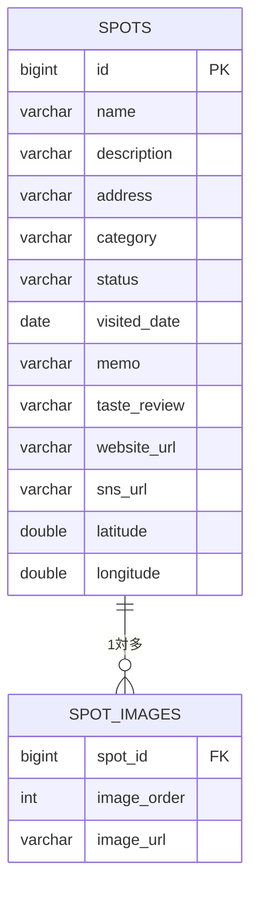

# SweetSpot (スウィートスポット) 🍰📍

> 行きたいお店・行ったお店を「直感的に管理」できる、自分だけのグルメ＆お出かけスポット管理アプリ

---

## 📖 アプリケーションの概要

「行ってみたいカフェ」や「美味しかったレストラン」の情報を一元管理できるWebアプリケーションです。  
カテゴリでの絞り込みや、行った日付の記録、リストとグリッドの表示切り替えができます。

- **本番環境URL:** (ローカル環境のためなし)
- **テスト用アカウント:** 不要

---

## 💡 開発した背景・理由

SNSで気になったお店をメモしても後から探すのが大変だったため、直感的に楽しく整理できるアプリを作りました。  
特に「訪問済みのスタンプ表示」や「スクロールしても使いやすいメニュー」など、使い心地にこだわっています。

---

## 🎨 主な機能

- **スポット一覧・絞り込み:** カテゴリやステータスで一瞬で検索できます。
- **表示切り替え:** リスト表示とグリッド表示をいつでも切り替えられます。
- **行った日付の記録:** 「行った」お店には訪問日とスタンプがつきます。
- **写真とメモ:** メイン写真やサブ写真、味の感想を記録できます。

---

## 🛠 使用技術 (技術スタック)

| カテゴリ           | 技術・ライブラリ                      |
| :----------------- | :------------------------------------ |
| **フロントエンド** | React, Vite, JavaScript, HTML5 / CSS3 |
| **バックエンド**   | Java 17, Spring Boot, Spring Data JPA |
| **データベース**   | H2 Database                           |

---

## 📐 ER図 (データベース設計)

