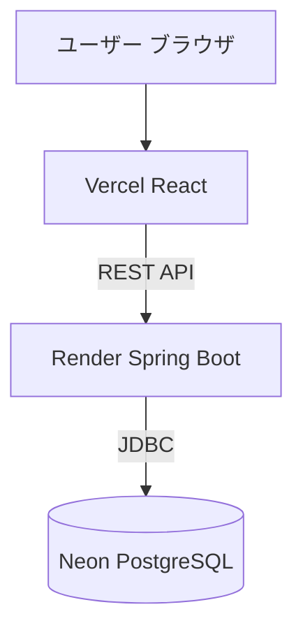
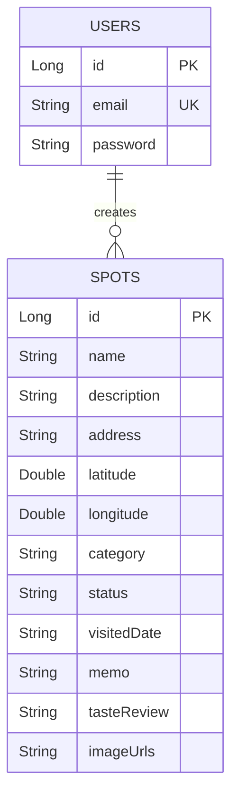

# Sweet Spot（スイーツ＆カフェ スポット管理アプリ）

> **「SNSで見つけた『行ってみたいお店』をスマートに整理・一覧化し、今日のおでかけを最高にするグルメガイド」**

---

## 📸 アプリケーションの雰囲気・機能デモ

|                                       トップ・一覧画面                                       |                                       訪問カレンダー画面                                       |                                    スポット編集・画像圧縮                                    |
| :------------------------------------------------------------------------------------------: | :--------------------------------------------------------------------------------------------: | :------------------------------------------------------------------------------------------: |
|  |  |  |
|                            カード・リスト形式でスポットを一覧比較                            |                               訪問日ごとの履歴表示と詳細モーダル                               |                         Canvas APIによる高速・軽量な画像アップロード                         |

- **本番Webサイト（フロントエンド）:** https://sweetspot-frontend.vercel.app/
- **APIサーバー（バックエンド）:** https://sweetspot-7kzg.onrender.com/api/spots

---

## 💡 アプリケーションの概要・開発背景

### 概要

X（旧Twitter）、Instagram、TikTokなどのSNSで見つけた近場のおいしいお店やカフェを登録・管理し、行きたい状態やカテゴリ別に瞬時に検索・比較できるWebアプリケーションです。

### 開発背景

SNSで「行ってみたいお店」を見つける機会が増え、以前はGoogleマップ等にピンを立てて保存していました。
しかし、実際に「今日どこに行こう」となった際、マップ上のピンだけでは**リストとして一覧化されておらず、カテゴリやその時の気分（「スイーツ」「カフェ」「行った／気になる」など）で比較・絞り込みがしづらい**という課題がありました。
この課題を解決するため、視覚的に比較でき、柔軟にタグ絞り込みや訪問カレンダー管理ができる本アプリを開発しました。

### 🛠️ 開発で工夫した点・苦労した技術的課題

- **無料クラウドインフラ（Render）のメモリ上限回避と画像保存の永続化**
  - **課題:** 無料インフラ環境（Render）では、サーバー再起動によって保存した画像ファイルが消去される「エフェメラルファイルシステム」の制約と、メモリ（512MB）上限による画像処理時の 500 エラーが発生していました。
  - **解決策:** 画像のリサイズ・圧縮処理をバックエンドからフロントエンド（ブラウザの Canvas API）へ移譲。画像を長辺 800px・画質 70% に軽量化して Base64 化し、PostgreSQL（Neon）の `TEXT` 型カラムへ直接保存する設計に変更しました。これにより、サーバーのメモリ負荷を 0 に抑えつつ、再起動しても絶対に画像が消えない完全な永続化を達成しました。

---

## 🛠️ 主な使用技術・インフラ構成

| カテゴリ                    | 技術スタック                                                          |
| :-------------------------- | :-------------------------------------------------------------------- |
| **フロントエンド**          | React 18, React Router v6, Axios, Vite                                |
| **バックエンド**            | Java 21, Spring Boot 3.x, Spring Security, Spring Data JPA, Hibernate |
| **データベース**            | PostgreSQL (Neon Database)                                            |
| **インフラ / ホスティング** | Vercel（フロントエンド）, Render（バックエンド）                      |
| **ビルド / ツール**         | Maven, Git / GitHub                                                   |

### インフラ構成図



### ER図（データベース設計）



---

## 📱 画面および主要機能の説明

- **ユーザー認証機能**
  - 会員登録 / ログイン・ログアウト（JWT認証・Security実装）
- **スポット管理（CRUD機能）**
  - スポット一覧表示（リストビュー / グリッドビュー切替）
  - スポット新規登録・編集（クライアント側画像自動圧縮・リアルタイムプレビュー表示）
  - スポット詳細表示・削除機能
- **検索・絞り込み機能**
  - カテゴリタグ（#カフェ、#スイーツ など）による即時フィルタリング
  - 訪問ステータス（行った / 気になる / 時間があれば）による絞り込み
  - ソート機能（最新順 / 古い順 / 五十音順）
- **訪問カレンダー機能**
  - 訪問日ごとのスポット履歴表示および詳細モーダル表示
- **マップ連携**
  - 登録住所から Google Maps へのダイレクト遷移リンク生成

---

## 💻 ローカル環境での起動方法

他のエンジニアがローカル環境で動作確認するためのセットアップ手順です。

### 必要環境

- Node.js (v18以上)
- Java JDK 21
- Git

### 1. リポジトリのクローン

```bash
git clone [https://github.com/maeeri1027-maker/sweetspot-frontend.git](https://github.com/maeeri1027-maker/sweetspot-frontend.git)
git clone [https://github.com/maeeri1027-maker/sweetspot-backend.git](https://github.com/maeeri1027-maker/sweetspot-backend.git)
```

### 2. バックエンドの起動

```bash
cd sweetspot-backend
./mvnw spring-boot:run
```

### 3. フロントエンドの起動

```bash
cd sweetspot-frontend
npm install
npm run dev
```

---

## 🔑 テスト用ログイン情報

評価・動作確認用に以下のテストアカウントをご利用いただけます。

- **メールアドレス:** `test@example.com`
- **パスワード:** `password123`

---

**製作者:** Mitani
